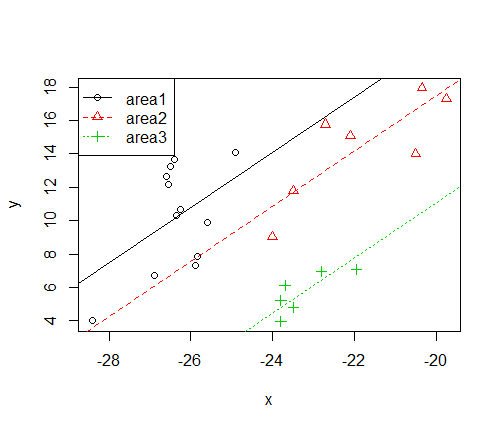

# basicANCOVA: an R package for One-way ANCOVA Judgement and Plot

## Installation (1.0.1)

**version 1.0.1** from Github

    ### version 1.0.1
	
	install.packages("devtools")
	library(devtools)   
	install_github("PhDMeiwp/basicANCOVA@master", force = TRUE)
	library(basicANCOVA)

## Usage

    ANCOVAplot(x, y, groups,data, 
       			col=1:length(levels(groups)),
       			pch=1:length(levels(groups)),
       			lty=1:length(levels(groups)),
       			legendPos="topleft",
       			...)

# Examples
	

    library(basicANCOVA)
    data("isotope",package = "basicANCOVA")
    View(isotope)
    #rename
    groups<-isotope$area
    x<-isotope$d13C
    y<-isotope$d15N
    data<-isotope
    
    ANCOVAplot(x,y,groups,data)

 
