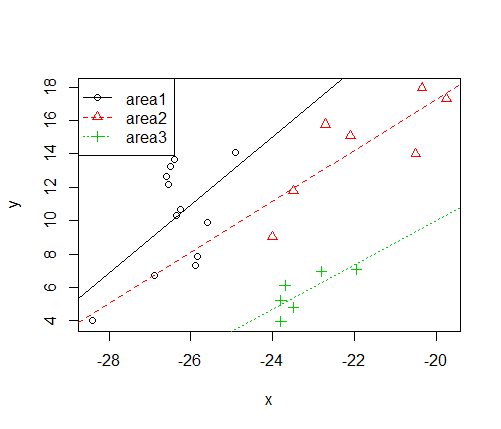

# basicANCOVA: an R package for One-way ANCOVA Judgement and Plot

## Installation (1.0.2)

	install.packages("devtools")
	library(devtools)   
	install_github("PhDMeiwp/basicANCOVA@master", force = TRUE)
	library(basicANCOVA)

## Usage

    ANCOVAplot(x, y, groups,data, 
       			col = 1:length(levels(groups)),
       			pch = 1:length(levels(groups)),
       			lty = 1:length(levels(groups)),
				Fig.slope = 1,
       			legendPos = "topleft",
       			...)

# Examples
	

    library(basicANCOVA)
    data("isotope",package = "basicANCOVA")
    View(isotope)
    #rename
    groups<-isotope$area
    x<-isotope$d13C
    y<-isotope$d15N
    data<-isotope
    
    ANCOVAplot(x, y, groups, data, Fig.slope = 1) # same slope (ANCOVA results).

 
	
	ANCOVAplot(x, y, groups, data, Fig.slope = 0) # different slopes (linear regression results).  
	
 
 
 # Contributors
 
 - R Codes to draw graph with different slopes mainly cite from [library(HH)](https://github.com/cran/HH/blob/master/R/ancovaplot.R#subset=(cc==cci)).
